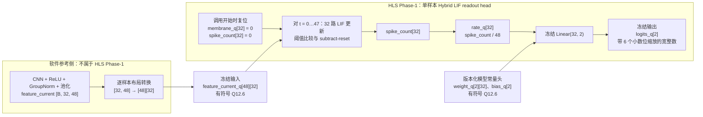

# Direct-current Hybrid-SNN 与 HLS Phase-1 接口契约

> **阅读目的**：本文把教师可审阅的完整 Hybrid-SNN 模型，与第一阶段 HLS（High-Level Synthesis，高层次综合）交付物明确分开。完整模型的 CNN/GroupNorm 前端仍在软件参考侧；HLS Phase-1 只实现固定的 Hybrid LIF（漏积分发放）读出头。

相关入口：[完整 Hybrid-SNN 架构图](hybrid_snn_architecture.md)｜[HLS Phase-1 说明](../hls/README.md)｜[软件定点可行性结果](../experiments/channel8_snn_hardware/RESULTS.md)

## 1. 完整冻结模型：从 EEG 到两类 logits

```mermaid
flowchart LR
    EEG["EEG 窗口<br/>[B, 1, 8, 384]"] --> Spatial["逐点空间 Conv2d<br/>混合 8 个 EEG 通道"]
    Spatial --> Temporal["深度时间 Conv2d<br/>提取每个特征的时间模式"]
    Temporal --> Relu["ReLU<br/>整流线性激活"]
    Relu --> Norm["GroupNorm<br/>每个样本独立归一化"]
    Norm --> Pool["自适应平均池化<br/>特征张量 [B, 32, 48]"]
    Pool --> Current["Direct-current（直流编码）<br/>连续特征直接作为输入电流"]
    Current --> Lif["48 步 subtract-reset LIF<br/>beta = 0.90；threshold = 0.5"]
    Lif --> Counts["spike_count [B, 32]<br/>累计每个通道的脉冲"]
    Counts --> Rates["发放率 [B, 32]<br/>spike_count / 48"]
    Rates --> Linear["Linear(32, 2)"]
    Linear --> Logits["logits [B, 2]<br/>alert / drowsy 未归一化分数"]
```



`B` 表示批大小。该冻结基线使用 Channel8 的 8 个通道与每窗口 384 个采样点；配置中的 `n1=16`、`depth_multiplier=2` 因而形成 32 个特征通道，池化后固定为 48 个离散时间步。模型中的 `GroupNorm`（组归一化）按单个样本归一化，不依赖 batch 内统计量。

**Direct-current（直流编码）**表示把池化后的连续特征值逐步送入 LIF，既不再编码为随机 Poisson 脉冲，也不在本阶段引入 Delta 事件编码。**LIF** 的语义为：先把历史膜电位按 `beta` 衰减并加上当前输入；膜电位达到阈值时发放一个脉冲，再减去一个阈值（subtract-reset，减阈值复位）。训练使用替代梯度处理脉冲函数的不可导性；冻结推理语义是确定性的阈值比较与减阈值复位。

### 张量与软件模型层次

| 位置 | 名称 / 操作 | 形状 | 说明 |
|---|---|---:|---|
| 输入 | EEG | `[B, 1, 8, 384]` | 1 个输入平面、8 个选定 EEG 通道、384 个采样点。 |
| 前端 | 逐点空间卷积 | `[B, 16, 1, 384]` | 卷积核跨 8 个输入通道。 |
| 前端 | 深度时间卷积 | `[B, 32, 1, 353]` | 32 个特征通道；时间核长度为 32。 |
| 前端 | ReLU → GroupNorm → squeeze | `[B, 32, 353]` | GroupNorm 保持每个样本独立归一化。 |
| 时间接口 | 自适应平均池化 | `[B, 32, 48]` | Python/软件参考中为**通道优先**：`[channel, time]`。 |
| 读出头 | 直流输入电流 | `[B, 32, 48]` | 特征值直接作为每个通道、每个时间步的输入电流。 |
| 读出头状态 | 膜电位、脉冲计数 | 各为 `[B, 32]` | 每个样本从零开始；不跨样本保存。 |
| 读出头输出 | 发放率 | `[B, 32]` | `spike_count / 48`。 |
| 分类器 | 线性层与 logits | `[B, 2]` | 两类的 **logit**（softmax 前的未归一化分类分数）。 |

## 2. HLS Phase-1：只冻结 LIF 读出头的边界

Phase-1 的目的不是将完整 EEG 网络直接综合到 FPGA，而是先对已冻结的 LIF 读出头建立可验证的外部定点接口。CNN、ReLU、GroupNorm 与自适应平均池化继续在软件参考侧产生特征；它们**不是**此阶段的 HLS C++、csim 或 csynth 交付物。



### 数据布局：软件 `[B, 32, 48]` 与 HLS `[48][32]`

对一个样本，软件特征 `feature_current[channel][time]` 的值按下式送入 HLS：

```text
feature_current_q[time][channel]
    = quantized(feature_current[channel][time])

其中 time = 0…47，channel = 0…31。
```

这只是接口边界上的转置：**不改变数值、不改变 `t=0` 到 `t=47` 的时间顺序，也不改变通道编号。** HLS 采用时间优先的 `[48][32]`，使时间步成为外层循环；软件参考保留通道优先的 `[32, 48]`。HLS-1 必须用黄金向量或等价测试验证这一转置契约，不能把两个维度当作同一内存顺序而省略验证。

## 3. 冻结的 Phase-1 外部接口

**Q12.6** 指总位宽 12 位、其中 6 位为小数的有符号定点表示；对外部原始整数 `q`，其数值语义为 `q / 64`。当前软件定点参考在量化边界使用缩放、取整与有符号范围裁剪；本 HLS-0 文档冻结的是下面的外部 Q12.6 载荷和缩放语义，不把尚未分析完成的内部算术细节伪装成既定 RTL 行为。

| 项目 | 冻结契约 |
|---|---|
| Top function 处理单位 | 一次调用处理一个样本；不引入批接口、AXI、DMA 或运行时权重加载。 |
| 输入 | `feature_current_q[48][32]`；每个元素为有符号 Q12.6 整数。第 0 维是 `t=0…47` 的时间轴，第 1 维是 32 个 CNN 特征通道。 |
| 输入来源 | 软件前端生成 `[B, 32, 48]` 特征电流后，对单个样本转置为 `[48][32]` 并量化；CNN/GroupNorm 前端不在 Phase-1 内。 |
| LIF 常量 | 概念参数为 `beta=0.90`、`threshold=0.5`。外部 Q12.6 常量分别固定为 `beta_q=58`、`threshold_q=32`。 |
| `beta_q` 的解释 | `58 / 64 = 0.90625`，所以 `beta_q=58` 是对概念参数 `0.90` 的 Q12.6 量化值，**不是**精确的十进制 `0.90`。 |
| 复位 | 每次 top function 调用前把 32 个膜电位与 32 个脉冲计数均清零；样本、被试和数据折之间均无状态继承。 |
| 脉冲计数与发放率 | 48 步更新后得到 `spike_count[32]`；`rate_q[32]` 表示按 48 归一化且保持 6 个小数位缩放的发放率。 |
| 模型常量 | `weight_q[2][32]` 与 `bias_q[2]` 均为有符号 Q12.6，由**版本化模型常量头**随冻结 checkpoint 提供；Phase-1 不设计运行时加载。类别行顺序必须由该常量版本和其清单共同固定。 |
| 输出 | `logits_q[2]` 为两个类别的未归一化分数；对外使用保留 6 个小数位缩放的有符号**宽整数**，数值读取语义为 `logits_q / 64`。无 softmax。 |
| HLS-1 待冻结项 | 内部乘法/累加器/膜电位的最小安全位宽、溢出处理、饱和策略、每一步舍入规则和具体 C++ 类型，均须在范围分析与软件/黄金向量对齐后由 HLS-1 固定。 |

概念上的实数 LIF 更新为：

```text
membrane[t, c] = beta × membrane[t - 1, c] + current[t, c]
spike[t, c]    = 1, 当 membrane[t, c] ≥ threshold；否则为 0
membrane[t, c] = membrane[t, c] - spike[t, c] × threshold
spike_count[c] = Σ spike[t, c]，t = 0…47
```

上式说明算法语义，而**不**提前规定 HLS 内部乘法与累加的位宽、舍入或饱和实现。现有 `src/dc_eeg/snn_hardware.py` 是软件浮点/定点可行性参考；HLS-1 应以它和导出的黄金向量为对齐对象，再明确可综合的逐位规则。

### 状态表

| 状态 / 常量 | 规模 | 生命周期 | Phase-1 要求 |
|---|---:|---|---|
| `feature_current_q` | `48 × 32` | 单次调用输入 | 只读；时间优先布局。 |
| `membrane_q` | 32 | 单次调用内 | 调用开始置零；每时间步更新；调用结束丢弃。 |
| `spike_count` | 32 | 单次调用内 | 调用开始置零；48 步累计；用于计算发放率。 |
| `weight_q` | `2 × 32` | 模型版本生命周期 | 只读静态常量；由版本化常量头提供。 |
| `bias_q` | 2 | 模型版本生命周期 | 只读静态常量；由版本化常量头提供。 |
| `beta_q` / `threshold_q` | 各 1 | 接口/模型常量 | 分别固定为 58 / 32；不作为每样本可变输入。 |

## 4. 术语表

| 术语 | 中文解释 |
|---|---|
| Direct-current（直流编码） | 将连续 CNN 特征直接作为每个离散时间步的 LIF 输入电流；不需要随机脉冲编码器。 |
| LIF（Leaky Integrate-and-Fire） | 漏积分发放神经元。膜电位随时间累积并按 `beta` 保留历史；达到阈值时产生脉冲。 |
| subtract-reset（减阈值复位） | 发放后从膜电位减去一个阈值，而不是直接把膜电位清为零。 |
| GroupNorm（组归一化） | 在单个样本内按组归一化的层，不依赖 batch 的运行均值或方差。 |
| spike count（脉冲计数） | 一个特征通道在 48 个时间步内发放的脉冲总数。 |
| spike rate（发放率） | `spike_count / 48`；用于把 48 步的计数缩放成 0 到 1 附近的读出特征。 |
| logit | softmax 前的未归一化分类分数；本接口输出两个 logits 而非概率。 |
| Q12.6 | 有符号总 12 位、小数 6 位定点格式；外部整数载荷以 64 为缩放因子。 |
| HLS | High-Level Synthesis，高层次综合；将受约束的 C/C++ 描述综合为 FPGA RTL 的流程。 |
| csim / csynth | HLS 的 C 级仿真 / C 或 C++ 到 RTL 的综合阶段；两者都还不是板端运行结果。 |
| 黄金向量 | 对同一输入、常量和数值规则保存的期望输出，用于逐项比较软件参考与后续 HLS 实现。 |

## 5. 证据边界与下一阶段

截至 HLS-0，仓库已有的是 Hybrid-SNN 的 Python 模型和读出头的**软件**定点可行性预研：目标器件规划为 `xc7z020clg400-1`，时钟规划假设为 100 MHz，Q12.6 被选为第一版 HLS 候选。这里的器件与时钟仅用于规划及软件代理，不是综合后的资源、时序或频率结果。

本文**不**声称已经具备 HLS C++ 内核、csim、csynth、Vivado 工程、时序/资源报告、bitstream、板端回放、在线 EEG 流水线或实测功耗。SynOps、延迟和存储若出现在现有软件结果中，也只能称为软件分析代理。后续 HLS-1 的最小工作是：导出版本化常量与黄金向量、落实本接口的可综合 C++、验证转置/复位/量化对齐，然后分别记录 csim 与 csynth 证据；任何板端或能耗结论都需要独立保留相应工件和测量方法。