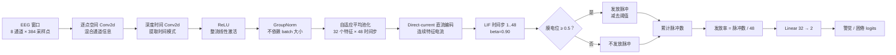

# Hybrid-SNN 架构图

## 模块说明

| 模块 | 作用 | 部署含义 |
|---|---|---|
| 逐点空间卷积 | 混合选定 EEG 通道 | 权重可固定 |
| 深度时间卷积 | 提取每个特征的时间模式 | 参数量较小、便于分离实现 |
| GroupNorm（组归一化） | 对每个样本独立归一化 | 避免动态 BN 在 BS=1 时依赖 batch 统计量 |
| 自适应池化 | 固定产生 48 个时间步 | 形成确定性的时间接口 |
| Direct-current（直流编码） | 将连续特征直接送入 LIF | 由编码消融实验选出 |
| LIF | 积分、比较阈值、减阈值复位 | 每个样本结束后清空膜电位 |
| 脉冲计数读出 | 汇总 48 个时间步的脉冲 | 目前只是软件代理，不是能耗测量 |
| 线性分类器 | 将 32 个发放率映射为两类 | 适合进行定点实现研究 |

## 为什么选择直流编码

在当前归一化 CNN 特征空间中，amplitude/count（幅值/计数事件）和 signed Delta（带符号差分事件）编码虽然降低了脉冲率，但造成较大的准确率和 Macro-F1 损失。因此当前基线冻结为 direct-current。这个选择说明它更适合当前任务和特征表示，不等于已经证明它的硬件能耗最低。
