# Hybrid-SNN Architecture Diagram

```mermaid
flowchart LR
    A[EEG window\n8 channels x 384 samples] --> B[Pointwise spatial Conv2d\nchannel mixing]
    B --> C[Depthwise temporal Conv2d\nper-feature temporal filters]
    C --> D[ReLU]
    D --> E[GroupNorm\nbatch-independent]
    E --> F[Adaptive average pool\n32 features x 48 steps]
    F --> G[Direct-current encoding\ncontinuous feature current]
    G --> H[LIF step t=1..48\nmembrane beta=0.90]
    H --> I{membrane >= 0.5?}
    I -->|yes| J[Emit spike\nsubtract threshold]
    I -->|no| K[No spike]
    J --> L[Spike count accumulation]
    K --> L
    L --> M[Rate = spike count / 48]
    M --> N[Linear 32 -> 2]
    N --> O[Alert / Drowsy logits]
```

## Module table

| Stage | Role | Deployment note |
|---|---|---|
| Pointwise spatial convolution | Mix the selected EEG channels | Fixed convolution weights |
| Depthwise temporal convolution | Extract per-feature temporal patterns | Separable and parameter-efficient |
| GroupNorm | Normalize each sample independently of batch size | Avoids dynamic-BN BS=1 dependence |
| Adaptive pooling | Produce exactly 48 simulation steps | Deterministic temporal contract |
| Direct-current | Pass continuous current to LIF | Selected after encoding ablation |
| LIF | Integrate, threshold and subtract-reset | Local membrane state resets per sample |
| Spike-count readout | Aggregate 48 spikes steps | Software proxy only, not energy measurement |
| Linear classifier | Map 32 rates to two classes | Small head suitable for fixed-point study |

## Why Direct Current

Deterministic amplitude/count and signed Delta encoders reduced spike rate but produced large
accuracy and macro-F1 losses on the current normalized feature representation. Direct-current is
therefore the frozen baseline for architecture and fixed-point work.
